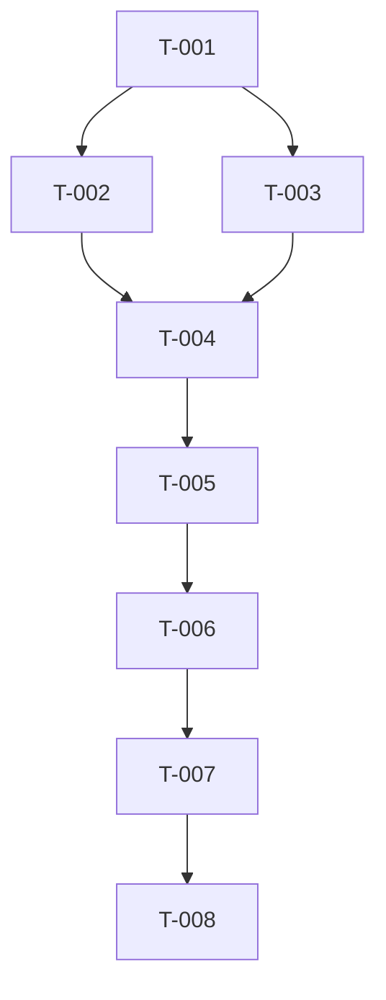

# 任务拆解: {{FEATURE_NAME}}

**关联需求**: {{PRD_LINK}}  
**关联方案**: {{SPEC_LINK}}  
**编写日期**: {{DATE}}  
**状态**: 📝 PLAN / 🔄 DEV / ✅ DONE

---

## 任务列表

<!-- 任务粒度建议控制在 1 人天内，总任务数建议 ≤8 个 -->

| ID | 任务 | 验收标准 | 依赖 | 状态 | 负责人 |
|----|------|----------|------|------|--------|
| T-001 | {{TASK_001_DESC}} | {{TASK_001_AC}} | - | 📝 待开始 | {{OWNER}} |
| T-002 | {{TASK_002_DESC}} | {{TASK_002_AC}} | T-001 | 📝 待开始 | {{OWNER}} |
| T-003 | {{TASK_003_DESC}} | {{TASK_003_AC}} | T-001 | 📝 待开始 | {{OWNER}} |
| T-004 | {{TASK_004_DESC}} | {{TASK_004_AC}} | T-002, T-003 | 📝 待开始 | {{OWNER}} |
| T-005 | {{TASK_005_DESC}} | {{TASK_005_AC}} | T-004 | 📝 待开始 | {{OWNER}} |
| T-006 | {{TASK_006_DESC}} | {{TASK_006_AC}} | T-005 | 📝 待开始 | {{OWNER}} |
| T-007 | {{TASK_007_DESC}} | {{TASK_007_AC}} | T-006 | 📝 待开始 | {{OWNER}} |
| T-008 | {{TASK_008_DESC}} | {{TASK_008_AC}} | T-007 | 📝 待开始 | {{OWNER}} |

---

## 任务详情

### T-001: {{TASK_001_NAME}}

**任务描述**: {{TASK_001_DETAIL}}

**验收标准**:
- [ ] {{AC_001_1}}
- [ ] {{AC_001_2}}
- [ ] {{AC_001_3}}

**技术要点**: {{TECH_POINT_001}}

**预计工时**: {{ESTIMATE_001}} 人天

---

### T-002: {{TASK_002_NAME}}

**任务描述**: {{TASK_002_DETAIL}}

**验收标准**:
- [ ] {{AC_002_1}}
- [ ] {{AC_002_2}}
- [ ] {{AC_002_3}}

**技术要点**: {{TECH_POINT_002}}

**预计工时**: {{ESTIMATE_002}} 人天

---

### T-003: {{TASK_003_NAME}}

**任务描述**: {{TASK_003_DETAIL}}

**验收标准**:
- [ ] {{AC_003_1}}
- [ ] {{AC_003_2}}
- [ ] {{AC_003_3}}

**技术要点**: {{TECH_POINT_003}}

**预计工时**: {{ESTIMATE_003}} 人天

---

### T-004: {{TASK_004_NAME}}

**任务描述**: {{TASK_004_DETAIL}}

**验收标准**:
- [ ] {{AC_004_1}}
- [ ] {{AC_004_2}}
- [ ] {{AC_004_3}}

**技术要点**: {{TECH_POINT_004}}

**预计工时**: {{ESTIMATE_004}} 人天

---

### T-005: {{TASK_005_NAME}}

**任务描述**: {{TASK_005_DETAIL}}

**验收标准**:
- [ ] {{AC_005_1}}
- [ ] {{AC_005_2}}
- [ ] {{AC_005_3}}

**技术要点**: {{TECH_POINT_005}}

**预计工时**: {{ESTIMATE_005}} 人天

---

### T-006: {{TASK_006_NAME}}

**任务描述**: {{TASK_006_DETAIL}}

**验收标准**:
- [ ] {{AC_006_1}}
- [ ] {{AC_006_2}}
- [ ] {{AC_006_3}}

**技术要点**: {{TECH_POINT_006}}

**预计工时**: {{ESTIMATE_006}} 人天

---

### T-007: {{TASK_007_NAME}}

**任务描述**: {{TASK_007_DETAIL}}

**验收标准**:
- [ ] {{AC_007_1}}
- [ ] {{AC_007_2}}
- [ ] {{AC_007_3}}

**技术要点**: {{TECH_POINT_007}}

**预计工时**: {{ESTIMATE_007}} 人天

---

### T-008: {{TASK_008_NAME}}

**任务描述**: {{TASK_008_DETAIL}}

**验收标准**:
- [ ] {{AC_008_1}}
- [ ] {{AC_008_2}}
- [ ] {{AC_008_3}}

**技术要点**: {{TECH_POINT_008}}

**预计工时**: {{ESTIMATE_008}} 人天

---

## 依赖图

---

## 工时汇总

| 任务数 | 总工时 | 并行度 | 关键路径 |
|--------|--------|--------|----------|
| {{TASK_COUNT}} | {{TOTAL_ESTIMATE}} 人天 | {{PARALLEL_DEGREE}} | {{CRITICAL_PATH_LENGTH}} 人天 |

---

## 变更记录

| 日期 | 版本 | 变更内容 | 变更人 |
|------|------|----------|--------|
| {{DATE}} | v0.1 | 初稿 | {{AUTHOR}} |
