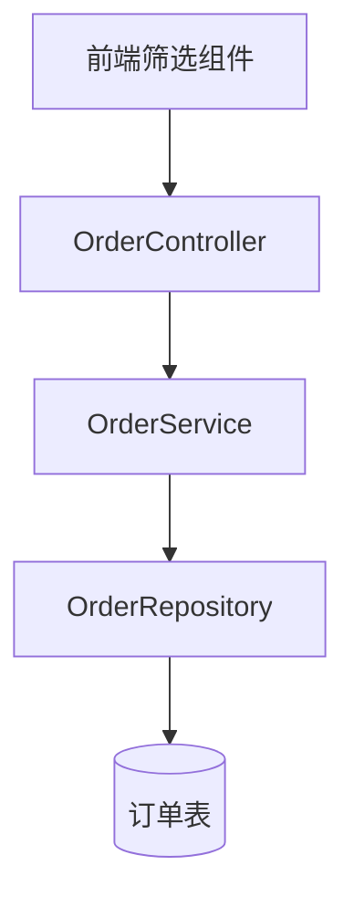

# 技术方案: 订单筛选功能

**关联需求**: PRD.md
**编写日期**: 2026-04-09
**状态**: PLAN

---

## 目标

### 核心目标

实现订单列表的多条件筛选功能，提升用户查询效率。

### 成功指标

- [ ] 筛选接口响应时间 < 500ms
- [ ] 用户查询操作步骤减少 50%

---

## 核心设计

### 架构概述



### 数据模型

**实体**: Order

| 字段 | 类型 | 说明 |
|------|------|------|
| id | BIGINT | 订单ID |
| status | VARCHAR(20) | 订单状态 |
| amount | DECIMAL(10,2) | 订单金额 |
| createdAt | TIMESTAMP | 创建时间 |

### 接口设计

**订单筛选接口**

- 路径: `/api/orders`
- 方法: `GET`
- 请求参数:
  ```json
  {
    "status": "PENDING",
    "startDate": "2026-01-01",
    "endDate": "2026-12-31",
    "minAmount": 100,
    "maxAmount": 10000
  }
  ```
- 响应格式:
  ```json
  {
    "code": 0,
    "data": [],
    "message": "success"
  }
  ```

---

## 锁定决策

| ID | 决策 | 理由 | 状态 |
|----|------|------|------|
| D-001 | 使用 Specification 模式实现动态查询 | 支持灵活的条件组合 | 已锁定 |
| D-002 | 筛选条件前端缓存 5 分钟 | 减少重复请求 | 已锁定 |
| D-003 | 金额范围使用闭区间 | 符合用户直觉 | 已锁定 |

---

## 风险评估

| 风险 | 概率 | 影响 | 缓解措施 |
|------|------|------|----------|
| 筛选条件组合过多导致性能问题 | 中 | 中 | 限制最多3个条件组合，添加索引优化 |
| 时间范围过大导致查询慢 | 中 | 高 | 限制最大查询范围为90天 |

---

## 附录

### 参考资料

- Spring Data JPA Specification 文档
- 订单表索引优化指南
